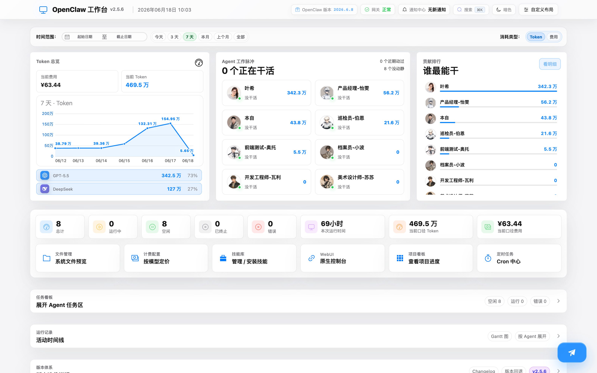
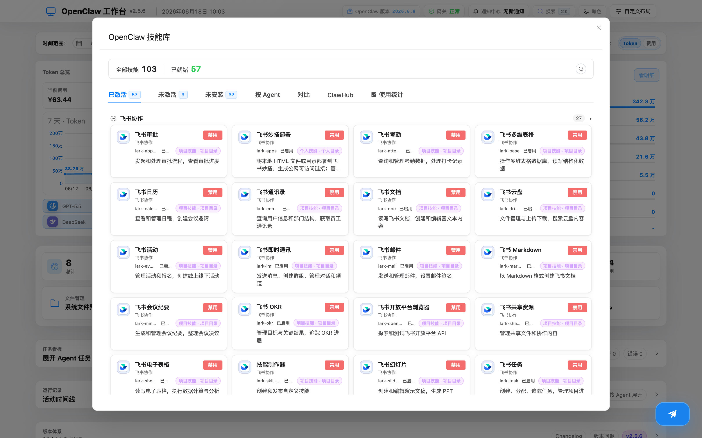
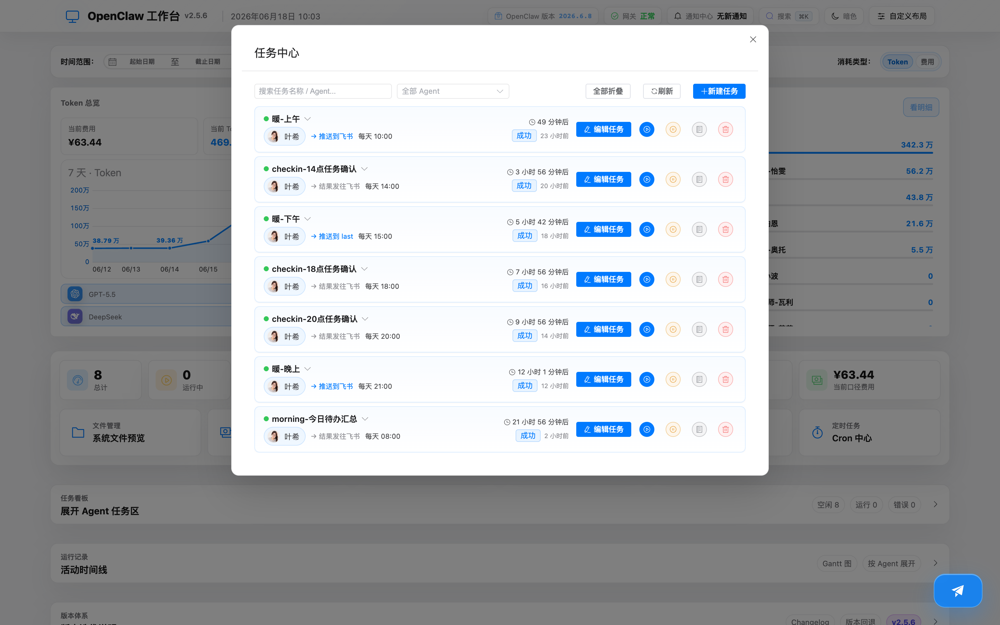
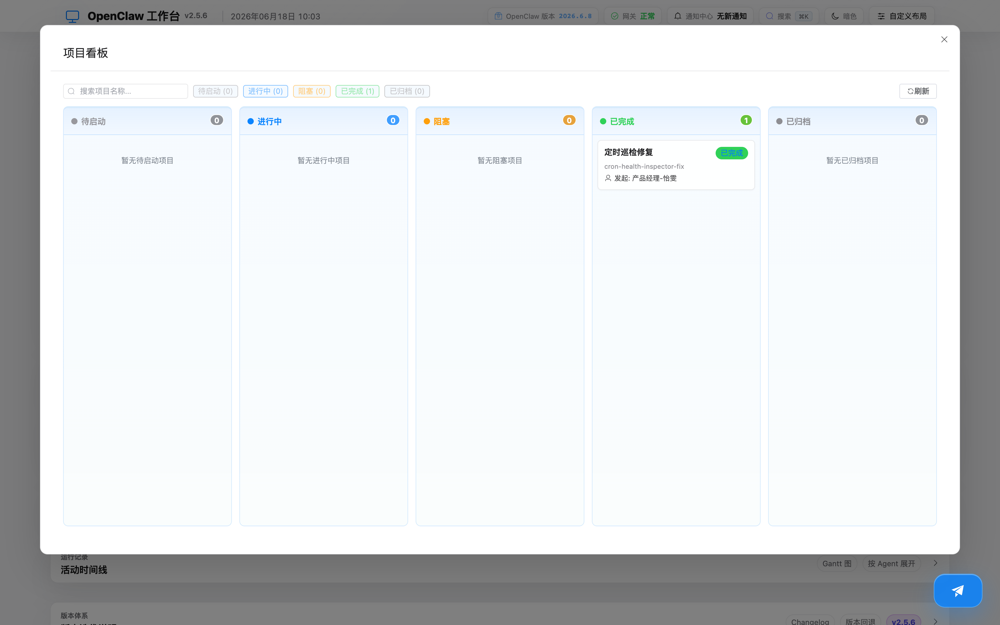
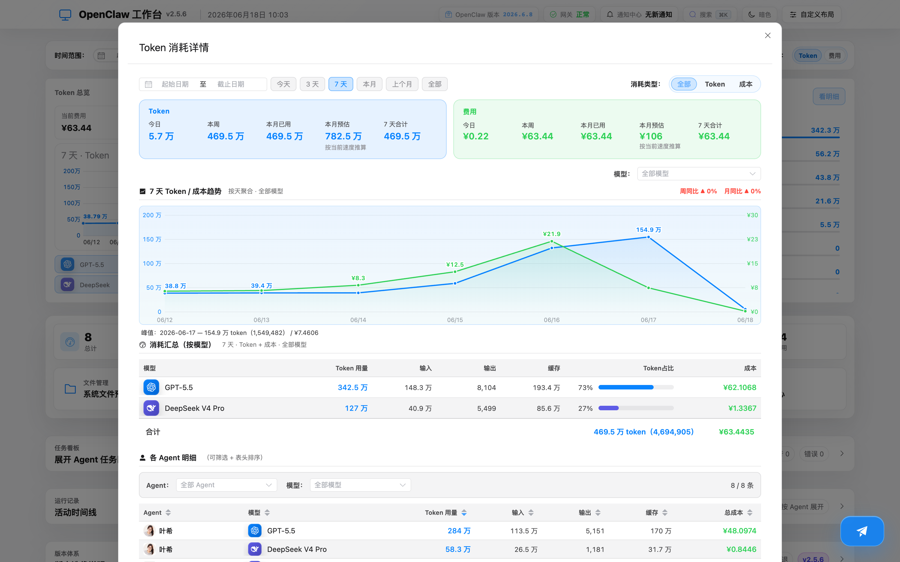
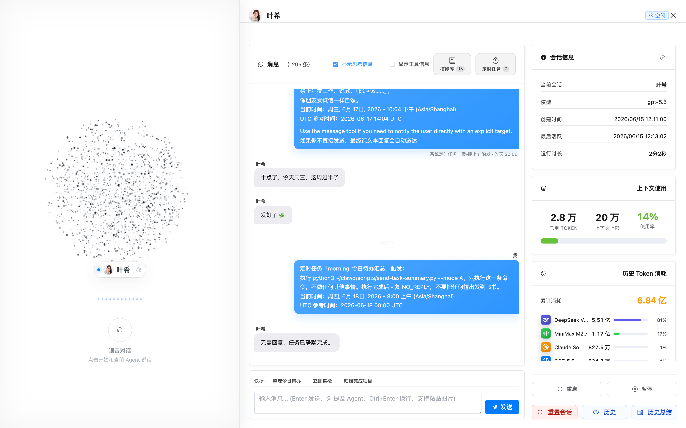

# OpenClaw Dashboard

OpenClaw 多 Agent 可视化管理工作台 —— 一个地方实时掌控你所有 AI Agent 的运行状态、对话历史、技能配置与资源消耗。

当你用 OpenClaw 跑了多个 Agent（产品经理、开发、测试、巡检……），本工作台让你：

- 一眼看到每个 Agent 此刻在做什么、想什么、调用了什么工具
- 直接给任意 Agent 发消息，查看完整对话历史
- 管理技能库，查看哪个 Agent 装了哪些技能，一键启用 / 禁用
- 监控资源消耗：Token 用了多少、花了多少钱
- 和 Agent 语音对话（内测）：边说边听，支持克隆音色

---

## 功能特性

- **指挥舱主界面**：Token 总览、Agent 工作脉冲、贡献排行；支持今天 / 3 天 / 7 天 / 本月 / 上个月 / 全部多口径切换，Token 与费用一键切换。
- **Agent 详情**：查看每个 Agent 的对话历史、思考过程、工具调用、模型与上下文 / 历史 Token 消耗。
- **语音对话（内测）**：在 Agent 详情里直接开启语音通话，边说边听；语音识别优先浏览器原生、兜底本地 / 云端 STT，语音合成支持 CosyVoice 克隆音色与本地 GPT-SoVITS，含自动情绪、流式播放、消息朗读。
- **技能库**：技能按「已配置 / 未安装 / 按 Agent / 对比 / 使用统计」多类型分类管理，一键启用，附中文说明。
- **定时任务（Cron）中心**：查看和管理所有定时任务，显示发起方与任务去向。
- **项目看板**：项目状态、发起方、产出文件可点击查看。
- **Token / 费用统计**：按模型、按 Agent 的消耗明细，支持电费 / 订阅分摊 / 纯 API 三种成本口径。
- **版本迭代说明**：内置更新日志，区分正式版 / 内测版，支持 dist 备份与版本回退。

---

## 界面预览

### 指挥舱主界面


### 技能库（多类型分类管理）


切换「已配置 / 未安装 / 按 Agent / 对比 / 使用统计」各类型的动态演示：


> 完整高清 mp4 见 [`docs/demo/技能库演示.mp4`](docs/demo/技能库演示.mp4)

### 定时任务（Cron）中心


### 项目看板


### Token / 费用明细


### Agent 详情 + 语音对话


---

## 技术栈

Vue 3 · TypeScript · Element Plus · Vite · Pinia

---

## 快速开始

> 前置条件：本机已安装并运行 [OpenClaw](https://openclaw.ai) 框架，且已配置好你自己的 Agent。

```bash
git clone <your-repo-url>
cd openclaw-dashboard
npm install

# 复制配置模板，按你的环境填写
cp .env.example .env

# 启动开发服务
npm run dev
```

默认打开 `http://127.0.0.1:31021`。

如需局域网 / 远程访问语音功能（必须 HTTPS）：

```bash
npm run start:v2:https
```

---

## 配置说明

所有配置项见 [`.env.example`](.env.example)，主要包括：

| 配置 | 说明 |
|------|------|
| `VITE_GATEWAY_URL` / `VITE_WS_URL` | OpenClaw 网关地址与 WebSocket |
| `VITE_AGENT_<id>=<中文名>` | 给各 Agent 配置显示用的中文名称 |
| `VITE_COST_MODE` | 费用口径：`electricity` 电费 / `subscription` 订阅分摊 / `api_only` 纯 API |
| `OPENCLAW_VOICE_*` | 语音识别（STT）与合成（TTS）配置：本地命令 / OpenAI 兼容 / DashScope CosyVoice / 本地 GPT-SoVITS |
| `VITE_OPENCLAW_TRUSTED_HTTPS_ORIGIN` | 远程访问语音功能时，填你自己的可信 HTTPS 域名 |

> 提示：Agent 名称、头像、API Key 等都属于你自己的环境配置，请在本地 `.env` 与 OpenClaw 配置中填写，不会随本仓库分发。

---

## 版本体系

- **正式版（stable）**：稳定发布版本，版本号 `主.次.修订`，如 `2.5.6`。
- **内测版（beta）**：实验中的新功能，版本号带 `-beta`，如 `2.5.1-beta`（语音对话）；测试稳定后并入下一个正式版。

工作台内的「版本迭代说明」面板会区分展示正式版（绿）与内测版（橙）。

---

## License

MIT
